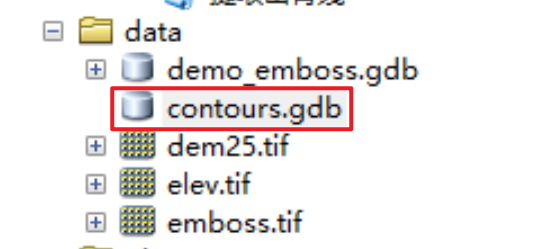

# 专题地图设计实验报告

> 42109232-地信2101-吕文博 

本实验报告由**浮雕效果地图**、**明暗等值线**、**山脊线地图**、**3D地形图**四个实验组成，其中前三个实验我将相应`ArcPy`代码封装成`ArcToolBox`，但由于在书写实验报告期间我无法使用`ArcPy`绘制想要的山脊线地图,便基于`R`语言实现后两个实验，同时仍提供第三个实验对应的`ArcToolBox`，总的来说，前两个实验基于`ArcPy`实现，后两个实验基于`R`语言实现

## 1.**浮雕效果地图**

#### 1.1 加载实验示例面至`ArcMap`


#### 1.2 运行`创造浮雕效果地图`工具，指定相应参数:


#### 1.3 结果展示


# 2. **明暗等值线**

#### 2.1 加载DEM至`ArcMap`(DEM需提前定义好投影坐标):


#### 2.2 创建`FileGDB`以存储生成的等高线要素类(注意创建个新的，否则工具会报错)

我在`data`文件夹下创建了`contours.gdb`：



#### 2.3 运行`创造明暗等值线`工具，指定相应参数:


#### 2.4 结果展示:


# 3. **山脊线地图**

### 3.1 使用`提取山脊线`工具的结果(不太优雅)


### 3.2 基于`R`语言绘制精美山脊图

```R
library(sf)
library(terra)
library(ggridges)
library(tidyverse)

rast('./data/elev.tif') |> 
  project(crs('epsg:32626')) |> 
  as.data.frame(xy=TRUE, na.rm=TRUE) |> 
  as_tibble() |> 
  mutate(class = cut_number(y, n = 3)) -> dem_df

ggplot() +
  geom_ridgeline(
    data = dem_df, aes(
      x = x, y = y,
      group = y,
      height = elevation,
      color = class
    ),
    scale = 25,
    fill = "black",
    size = .5,
    show.legend = FALSE
  ) +
  theme_void() +
  theme(plot.background = element_rect(fill = "grey20")) +
  scale_color_manual(values = alpha(
    c(
      "#007A33",
      "white",
      "#007A33"
    ),
    .95
  ))
```


# 4. **3D地形图**

```R
library(rayshader)
library(terra)
library(tidyverse)

rast('./data/elev.tif') |> 
  as.data.frame(xy=TRUE,na.rm=TRUE) |> 
  as_tibble() -> elev

ggplot(data = elev) +
  geom_tile(aes(x = x, y = y, fill = elevation)) +
  geom_contour(aes(x = x, y = y, z = elevation), color = "black") +
  scale_x_continuous("Long", expand = c(0, 0)) +
  scale_y_continuous("Lat", expand = c(0, 0)) +
  scale_fill_gradientn("Elevation", colours = terrain.colors(10)) +
  coord_fixed() -> ggtopo

plot_gg(ggtopo, width = 7, height = 4, raytrace = FALSE, preview = TRUE)
plot_gg(ggtopo, multicore = TRUE, raytrace = TRUE, width = 7, height = 4, 
        scale = 300, windowsize = c(1400, 866), zoom = 0.6, phi = 30, theta = 30)
```


# 实验总结：

`ArcGIS`具备较强的制图表达功能，但在3D地形渲染以及上色上选择不如开源代码工具方便，在实际专题地图编制工作中可以充分结合`ArcPy`编程与开源工具编程

> 注：本实验报告随附上前三个工具我自己构造的ArcGIS插件，欢迎给我反馈~